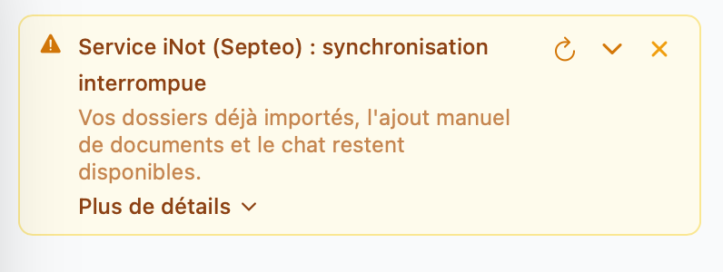

# Foire Aux Questions

## Que se passe-t-il si je me fais pirater mon compte Primmo?

Vous pouvez à tout moment réinitialiser votre mot de passe en vous rendant sur [https://chat.primmo.co/](https://chat.primmo.co/).&#x20;

Depuis le menu Paramètres, déconnectez-vous, puis cliquez sur "Mot de passe oublié" afin d'obtenir un lien vous permettant de réinitialiser votre mot de passe.

## Comment demander de l'aide au service support?

Ecrivez directement à [support@primmo.co](mailto:support@primmo.co)

## Comment me tenir informé des avancées à venir?

Vous pouvez consulter notre feuille de route publique sur [https://primmo.productlane.com/roadmap](https://primmo.productlane.com/roadmap)

## Ma connexion LRA est interrompue, que faire?

Il peut en effet arriver que votre fournisseur LRA (iNot, Fiducial, Fichorga) rencontre des problèmes permettant de consulter les données de votre étude depuis Primmo. Dans ce cas, merci de leur remonter le problème en suivant le guide fourni directement dans Primmo depuis l'encart visible en haut de l'onglet Chat, en cliquant sur "Plus de détails" puis en suivant les instructions.

<figure><figcaption></figcaption></figure>
